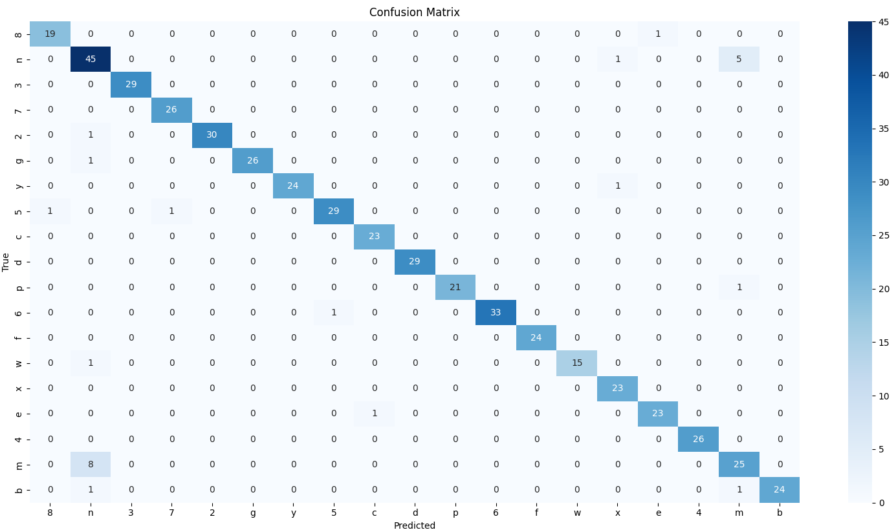
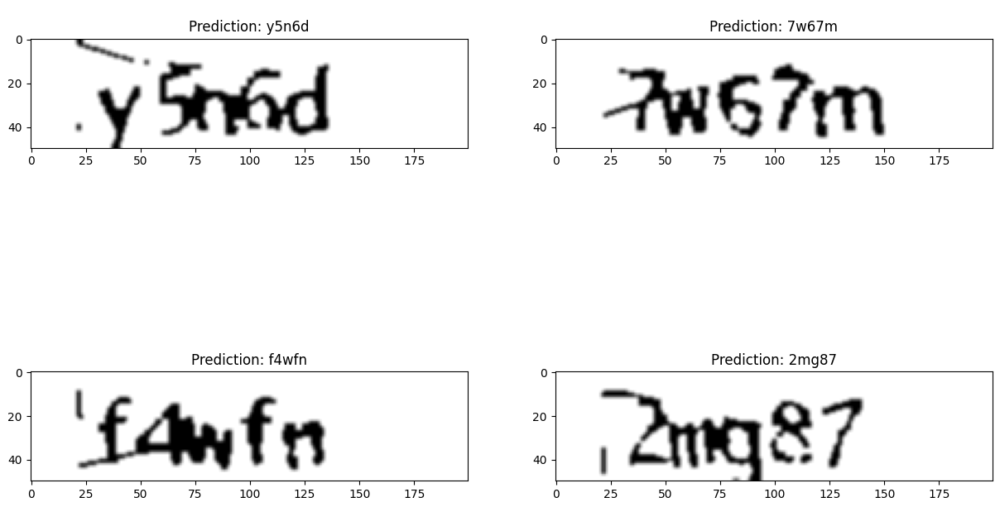

# ai-captcha-solver

  

# Project Overview

This project focuses on developing a Convolutional Neural Network (CNN) model to solve CAPTCHAs (Completely Automated Public Turing test to tell Computers and Humans Apart). The aim is to recognize and accurately decipher characters within CAPTCHA images, ultimately achieving a high success rate in solving CAPTCHAs

## Dataset
- The total dataset comprises 1040 sample images
- 80% of the data was utilized for training, while the remaining 10% was reserved for testing

## Dataset Analysis
- A frequency analysis of characters within the dataset revealed variations in character distribution
- Certain characters, such as 'n', appeared more frequently than others, potentially impacting model performance

## Pre-processing
- Pre-processing steps involved noise reduction, adaptive thresholding, morphological operations, and image reshaping to enhance segmentation and visual quality for CNN model input

## CNN Model Architecture
- The CNN model included convolutional layers, max-pooling layers, batch normalization, flatten layer, dense layers, dropout regularization, and output layers with sigmoid activation
- Model evaluation metrics included categorical cross-entropy loss, Adam optimizer

## Results Analysis
- Model parameters and performance metrics, including accuracy and loss, were analyzed
- Graphical representations and a confusion matrix were used to visualize model performance and identify areas for improvement

  

  

  

## Postmortem Analysis
- The project achieved a success rate ranging from 90% to 95% in solving CAPTCHAs, indicating the effectiveness of AI models in CAPTCHA recognition
- Future improvements may involve exploring different model architectures, data augmentation techniques, and regularization methods to further enhance accuracy
- Consideration of applying Connectionist Temporal Classification (CTC) layers for improved sequence alignment in future iterations of the project

